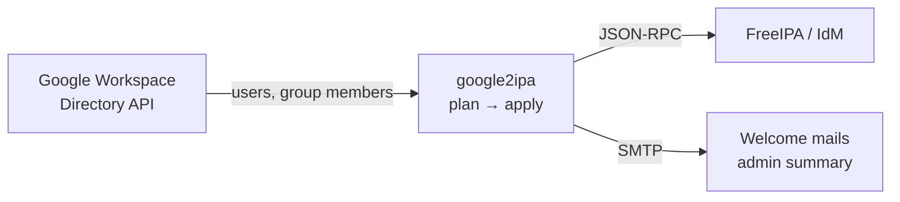

# google2ipa

**Sync Google Workspace users and groups into FreeIPA / Red Hat IdM.**

[](https://github.com/neverlless/google2ipa/actions/workflows/ci.yml)
[](https://goreportcard.com/report/github.com/neverlless/google2ipa)
[](https://github.com/neverlless/google2ipa/releases)
[](go.mod)
[](LICENSE)

google2ipa treats Google Workspace as the source of truth. It creates FreeIPA
accounts for new employees, keeps group memberships in step with Google
groups, and locks and later removes the accounts of people who left. It ships
as one static binary and a small, signed container image, and runs well as a
Kubernetes CronJob.

## Why

- **Google Cloud Directory Sync only goes the other way** (LDAP → Google). There is no
  supported way to provision FreeIPA from Google Workspace.
- **Offboarding is where it hurts.** When someone is removed from Google, their
  Linux, VPN, Kerberos and sudo access in FreeIPA should go too, without anyone having to remember.
- **No schema changes, no LDAP credentials.** google2ipa uses the FreeIPA JSON-RPC
  API with a least-privilege service account and marks the users it owns with a
  plain FreeIPA group.

## How it works



Each run reads all active Google users, reads the FreeIPA users in the
*managed group*, computes a plan, and applies it:

| Situation | Action |
| --- | --- |
| In Google, not in FreeIPA | **Create** the user with a FreeIPA-generated one-time password, add to the managed group and configured groups, optionally mail the password |
| In Google, locked by google2ipa earlier | **Enable** again |
| Managed, no longer synced from Google (deleted, suspended, archived, or dropped by the query/OU/domain filters) | **Disable**, record the time in `krbPrincipalExpiration` |
| Disabled by google2ipa for longer than `delete_after` | **Delete** (preserved by default, restorable with `ipa user-undel`) |
| Member of a mapped Google group | **Add/remove** the mapped FreeIPA groups |
| Exists in FreeIPA but not managed | Left alone (or adopted with `adopt_existing: true`) |
| Deleted earlier (preserved) and back in Google | Reported with the `ipa user-undel` command to restore it |
| More than `max_disable_percent` of users would be disabled | **Safety brake:** nothing is disabled, the run fails and the admin is notified |

Accounts that an administrator locked by hand are never unlocked by google2ipa. If a
username now belongs to a different Google email than the FreeIPA account's `mail`
(a reused name), the account is left alone and reported as an error.

## Features

- Full pagination: works for domains of any size
- Filters: Directory API query, organizational units (with sub-OUs), email domains
- Google group → FreeIPA group mapping, including nested Google groups
- FreeIPA-generated one-time passwords; users must change them at first login
- Welcome mail with a customizable template, one summary mail per run for admins
- `--dry-run` shows the plan without changing anything
- Safety brake against mass-disabling after a partial or empty Google response
- Delayed, recoverable deletion (`user-del --preserve`)
- No FreeIPA schema extension and no LDAP access needed
- Single static binary; multi-arch distroless image signed with cosign
- Tested against FreeIPA 4.12 (AlmaLinux 9); Red Hat Identity Management exposes the same API

## Quick start

**1. Google:** create a service account with domain-wide delegation and the
read-only Directory scopes, as described in [docs/google-setup.md](docs/google-setup.md).

**2. FreeIPA:** create the managed group and a service account with only the rights it needs
(full walkthrough in [docs/freeipa-setup.md](docs/freeipa-setup.md)):

```sh
kinit admin
ipa group-add google2ipa-managed --desc="Users managed by google2ipa"
ipa role-add google2ipa --desc="google2ipa sync"
ipa role-add-privilege google2ipa --privileges="User Administrators" \
  --privileges="Group Administrators" --privileges="Stage User Administrators"
ipa permission-add "google2ipa - Write user principal expiration" \
  --type=user --right=write --attrs=krbprincipalexpiration
ipa privilege-add "google2ipa offboarding"
ipa privilege-add-permission "google2ipa offboarding" \
  --permissions="google2ipa - Write user principal expiration"
ipa role-add-privilege google2ipa --privileges="google2ipa offboarding"
ipa user-add google2ipa-svc --first=google2ipa --last=service --password
ipa user-mod google2ipa-svc --setattr=krbPasswordExpiration=20380101000000Z
ipa role-add-member google2ipa --users=google2ipa-svc
```

**3. Configure** (`config.yaml`; every option is shown in [config.example.yaml](config.example.yaml)):

```yaml
google:
  credentials_file: /etc/google2ipa/sa.json
  admin_email: admin@example.com
freeipa:
  url: https://ipa.example.com
  username: google2ipa-svc
  password: ${FREEIPA_PASSWORD}
sync:
  default_groups: [ipausers]
```

**4. Run.** Start with a dry run and read the plan:

```sh
docker run --rm -v "$PWD:/etc/google2ipa:ro" -e FREEIPA_PASSWORD \
  ghcr.io/neverlless/google2ipa:latest --config /etc/google2ipa/config.yaml --dry-run
```

Drop `--dry-run` once the plan looks right.

## Deployment

- **Kubernetes:** [deploy/kubernetes/google2ipa.yaml](deploy/kubernetes/google2ipa.yaml) contains a
  Secret, a ConfigMap and a hardened CronJob that runs every 30 minutes.
- **Docker Compose:** [deploy/docker-compose.yml](deploy/docker-compose.yml) runs the container
  permanently with `--interval 30m`.
- **Binary:** download it from [Releases](https://github.com/neverlless/google2ipa/releases)
  and run it from cron or a systemd timer.

Verify the image signature:

```sh
cosign verify ghcr.io/neverlless/google2ipa:<version> \
  --certificate-identity-regexp 'https://github.com/neverlless/google2ipa/.*' \
  --certificate-oidc-issuer https://token.actions.githubusercontent.com
```

### Command line

```text
google2ipa [--config config.yaml] [--dry-run] [--interval 30m] [--timeout 30m] [--version]
```

| Exit code | Meaning |
| --- | --- |
| 0 | Success |
| 1 | The run finished with errors (see logs); other users were still processed. Also for `--dry-run` when the plan contains errors |
| 2 | Invalid configuration or flags |

## Configuration reference

`${VAR}` in any value is replaced with the environment variable `VAR`. An
unset variable is a configuration error. Keys are validated: a typo fails at start-up.

| Key | Default | Description |
| --- | --- | --- |
| `google.credentials_file` | — | Service account key (JSON). Empty: use Application Default Credentials together with `service_account_email` |
| `google.service_account_email` | — | Service account to impersonate when `credentials_file` is empty (Workload Identity) |
| `google.admin_email` | **required** | Admin user the service account acts as |
| `google.customer` | `my_customer` | Workspace customer ID |
| `google.query` | — | [Directory API user query](https://developers.google.com/admin-sdk/directory/v1/guides/search-users) |
| `google.org_units` | all | Only users in these OUs (sub-OUs included) |
| `google.domains` | all | Only users whose primary email is in these domains |
| `freeipa.url` | **required** | `https://` URL of a FreeIPA server |
| `freeipa.username` / `password` | **required** | Service account credentials |
| `freeipa.ca_file` | system trust | CA bundle, e.g. a copy of `/etc/ipa/ca.crt` |
| `freeipa.insecure_skip_verify` | `false` | Disable TLS verification (lab use only) |
| `sync.managed_group` | `google2ipa-managed` | Group that marks users owned by google2ipa; must exist |
| `sync.default_groups` | — | Groups every synced user is added to (never removed) |
| `sync.group_mapping` | — | `google-group@domain: [ipa-group, ...]`; membership is added and removed |
| `sync.exclude_users` | — | FreeIPA usernames that are never touched |
| `sync.username` | `local_part` | `local_part` (`john@x.com` → `john`) or `email` (→ `john.x.com`) |
| `sync.adopt_existing` | `false` | Take over existing FreeIPA users with the same username |
| `sync.max_disable_percent` | `20` | Safety brake threshold; `0` turns it off |
| `sync.max_username_length` | `32` | Longer usernames are skipped with an error; match FreeIPA's `ipa config-show` → Maximum username length |
| `sync.concurrency` | `4` | Parallel FreeIPA operations |
| `offboarding.disable` | `true` | Lock users who left Google |
| `offboarding.delete_after` | `30d` | Delete this long after locking (`0` = never). Units: `d`, `h`, `m` |
| `offboarding.preserve` | `true` | Delete into preserved users (restorable) |
| `notify.smtp.*` | port `587` | `host`, `port`, `username`, `password`, `from`; STARTTLS when offered, implicit TLS on port 465; 30 s timeout |
| `notify.welcome.enabled` | `false` | Mail new users their username and one-time password |
| `notify.welcome.subject` | `Your account is ready` | Subject line |
| `notify.welcome.template_file` | built-in | Go `text/template` with `.UID .Email .GivenName .FamilyName .FullName .Password .URL` |
| `notify.admin.enabled` / `to` | `false` | One summary mail per run that changed something or failed, including runs that could not reach Google or FreeIPA. The same unchanged errors are mailed once, not on every `--interval` pass |
| `log.format` / `level` | `json` / `info` | `json` or `text`; `debug`…`error` |

## FAQ

**Will it touch my existing FreeIPA users?** No. Only members of
`sync.managed_group` are changed. Existing users with the same username are
reported and left alone unless you set `adopt_existing: true`.

**What if Google returns an empty or partial list?** Any Google API error stops
the run before FreeIPA is touched. If the list looks too small, the safety
brake skips all disabling.

**How do I restore a deleted user?** See [restoring a deleted user](docs/freeipa-setup.md#restoring-a-deleted-user).

**Does it sync passwords?** No. Users set their FreeIPA password on first login.
Syncing Google passwords is not possible through the Google APIs.

**Red Hat IdM?** Yes. It is FreeIPA under another name and exposes the same API.

**I used a custom attribute to mark synced users.** See
[migration](docs/freeipa-setup.md#migration).

## Contributing

Issues and pull requests are welcome. See [CONTRIBUTING.md](CONTRIBUTING.md).
Report security issues privately as described in [SECURITY.md](SECURITY.md).

## License

[Apache License 2.0](LICENSE)
